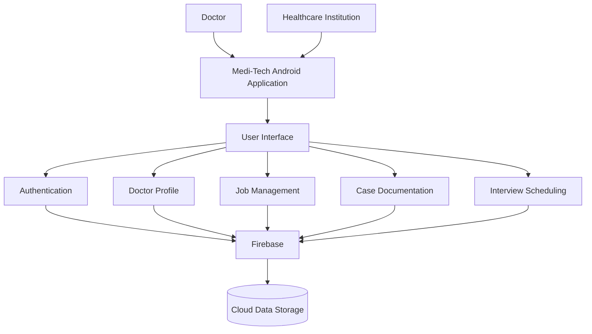
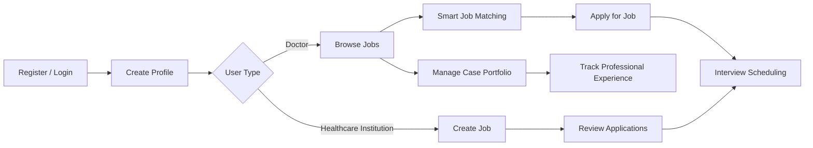
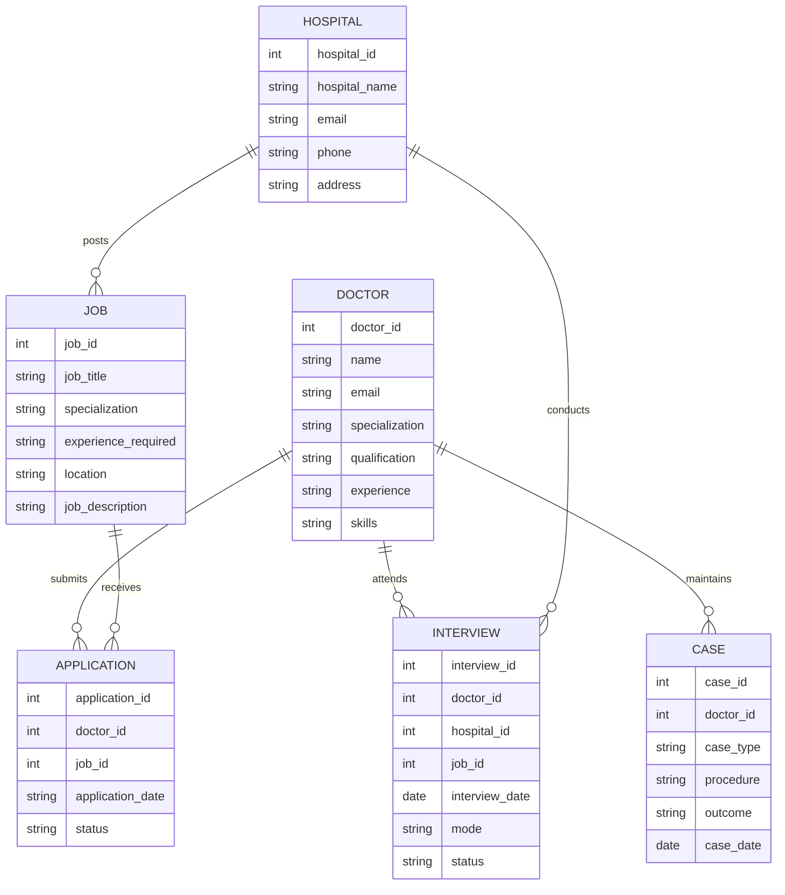

# 🩺 Medi-Tech

## Doctor Career & Case Management Platform

**Medi-Tech** is a healthcare-focused Android application designed specifically for doctors and healthcare institutions. It combines **professional career management, intelligent job discovery, clinical case documentation, and interview management** into a single platform.

Unlike general job portals, Medi-Tech focuses on the specific requirements of medical professionals, helping connect doctors with relevant opportunities while allowing them to maintain a structured professional portfolio.

---

## 📌 Project Overview

Doctors often depend on general job platforms for employment opportunities, while their clinical experience and case records are maintained separately.

Medi-Tech addresses this gap by providing a centralized platform where doctors can:

* 👨‍⚕️ Manage professional profiles
* 💼 Discover relevant job opportunities
* 🤖 Receive intelligent job matches
* 📋 Maintain clinical case records
* 📅 Manage interview schedules
* 🔐 Store professional information securely

The project was developed independently from **frontend to backend**, providing hands-on experience in Android development, Firebase integration, UI/UX design, database management, and application logic.

---

## 🎯 Objectives

The main objectives of Medi-Tech are:

1. Create a dedicated career platform for doctors.
2. Improve the doctor recruitment process.
3. Match doctors with suitable jobs based on their specialization, skills, and experience.
4. Provide structured clinical case documentation.
5. Simplify interview scheduling.
6. Provide centralized management of professional information.

---

# ✨ Key Features

### 👨‍⚕️ Doctor Profile

Doctors can maintain their professional information, specialization, qualifications, skills, and experience.

### 💼 Smart Job Matching

The system helps identify relevant job opportunities based on factors such as:

* Specialization
* Experience
* Skills
* Professional preferences

### 📋 Clinical Case Documentation

Doctors can maintain structured information about their clinical experience and cases, helping create a professional case portfolio.

### 📅 Interview Scheduling

The platform supports interview scheduling and recruitment workflow management.

### 🏥 Healthcare Institution Support

Healthcare institutions can participate in the recruitment process and connect with suitable medical professionals.

### 🔐 Secure Data Management

Professional and application-related information is centrally managed using Firebase services.

---

# 🏗️ System Architecture



---

# 🔄 System Workflow



---

# 🧩 Main System Modules

```text
Medi-Tech
│
├── 🔐 Authentication
│   ├── Doctor Login
│   ├── Doctor Registration
│   └── Institution Login
│
├── 👨‍⚕️ Doctor Management
│   ├── Professional Profile
│   ├── Specialization
│   ├── Qualifications
│   ├── Skills
│   └── Experience
│
├── 💼 Job Management
│   ├── Job Search
│   ├── Job Details
│   ├── Smart Matching
│   └── Job Applications
│
├── 📋 Case Management
│   ├── Case Records
│   ├── Procedures
│   ├── Clinical Experience
│   └── Case Portfolio
│
├── 📅 Interview Management
│   ├── Interview Scheduling
│   ├── Interview Details
│   └── Recruitment Workflow
│
└── 🔥 Firebase Services
    ├── Authentication
    ├── Database
    └── Data Storage
```

---

# 🗄️ Data Structure

The main entities of the system can be represented as:



---

# 🛠️ Technologies Used

| Technology         | Purpose                              |
| ------------------ | ------------------------------------ |
| **Kotlin**         | Android application development      |
| **XML**            | User interface design                |
| **Firebase**       | Backend services and data management |
| **Android Studio** | Application development              |

---

# 📱 Application Flow

```text
             ┌─────────────────┐
             │   Medi-Tech App │
             └────────┬────────┘
                      │
             ┌────────▼────────┐
             │ Login / Register│
             └────────┬────────┘
                      │
              ┌───────▼────────┐
              │  User Profile  │
              └───────┬────────┘
                      │
          ┌───────────┴───────────┐
          │                       │
     ┌────▼─────┐           ┌─────▼─────┐
     │  Doctor  │           │ Institution│
     └────┬─────┘           └─────┬─────┘
          │                       │
    ┌─────▼──────┐          ┌─────▼─────┐
    │ Find Jobs  │          │ Post Jobs  │
    └─────┬──────┘          └─────┬─────┘
          │                       │
    ┌─────▼──────┐          ┌─────▼──────┐
    │Smart Match │◄────────►│Applications│
    └─────┬──────┘          └─────┬──────┘
          │                       │
          └──────────┬────────────┘
                     │
              ┌──────▼──────┐
              │  Interview  │
              │  Scheduling │
              └─────────────┘

          Doctor Case Portfolio
                     │
              ┌──────▼──────┐
              │Case Records │
              └─────────────┘
```

---

# 🚨 Problems with Existing Systems

Existing platforms have several limitations for medical professionals:

* General job portals are not specialized for doctors.
* Limited filtering based on medical specialization and clinical skills.
* No dedicated clinical case documentation system.
* Practical experience is difficult to verify.
* Interview coordination can be manual and inefficient.
* Career information and clinical experience are often maintained separately.

---

# 💡 Proposed Solution

Medi-Tech brings these functionalities together into one specialized platform.

```text
Existing Approach

Job Portal ──────► Job Search
     +
Separate Records ─► Case Documentation
     +
Emails / Calls ───► Interview Scheduling


                 ↓


             Medi-Tech

       ┌───────────────────┐
       │ Career Management │
       ├───────────────────┤
       │ Smart Job Matching│
       ├───────────────────┤
       │ Case Documentation│
       ├───────────────────┤
       │ Interview System  │
       └───────────────────┘
```

---

# 👩‍💻 My Contribution

I developed the project from **frontend to backend**, including:

* Android application development
* UI/UX implementation
* Kotlin programming
* Firebase integration
* Application logic
* Database/data management
* Feature implementation
* System workflow design
* Testing and debugging

This project gave me practical experience in developing a complete application from concept to implementation.

---

# 📚 Learning Outcomes

Through Medi-Tech, I strengthened my skills in:

* 📱 Android Development
* 💻 Kotlin
* 🎨 UI/UX Design
* 🔥 Firebase
* 🗄️ Database Management
* ⚙️ Backend Logic
* 🧩 Application Architecture
* 🐛 Debugging & Testing
* 💡 Real-world Problem Solving

---

# 🔮 Future Scope

The platform can be further enhanced with:

* AI-powered job recommendations
* Advanced doctor-job matching
* Digital verification of professional experience
* Push notifications
* Career analytics
* Advanced hospital recruitment tools
* AI-based career assistance

---

# 👤 Developer

### Neha Singh

**BCA | Software Development & Technology Enthusiast**
**MSc Cyber Security**

Interested in:

`Android Development` • `Full Stack Development` • `AI` • `Web Development` • `Data Visualization`

---

## ⭐ Project Highlights

> **Medi-Tech is designed to bridge the gap between healthcare recruitment and professional case management by providing doctors and healthcare institutions with a dedicated digital platform.**

If you find this project interesting, feel free to ⭐ the repository and explore the implementation.
